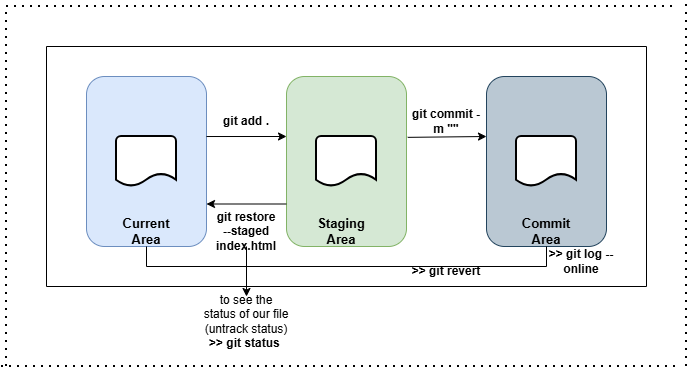

# Git Staging Area and Commit Guide

This repository explains how files move from the **Working Directory** to the **Staging Area** and finally into a **Commit** in Git.

---

## Git Areas Explained


### 1️. Working Directory (Current Area)

- This is where you create, edit, or delete files.
- Changes here are **not tracked** until you add them.

## 2️. Staging Area

- The staging area holds changes that are ready to be committed.

- You choose what goes into the next commit.

```
git add .
```

Example

```
git add index.html

```

Check staged files:

```
git status

git status -s 
```
## 3️. Commit Area (Repository)

- A commit saves a snapshot of staged changes into the Git repository.

- Each commit has a unique ID (hash).
```
git commit -m "Add initial version of index page"
```
## 4. Staging Area to Working repo
```
git restore --staged <file_name>
```
example 
```
git restore --staged index.html
```

## 5. commit area to working repo
```
git commit -m ""
git log --oneline
git log 
git revert --staged <commit id>
    or 
git reset -- staged .
```
example 
```
git commit -m "modifed file "
git log --oneline (copy the commit id)
git revert --staged (paste the commit id)
git reset --staged (paste here)
